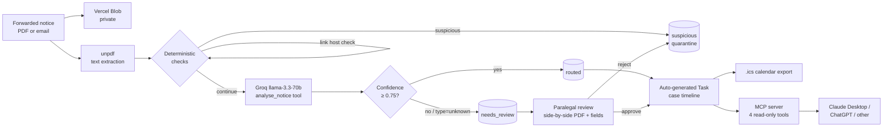

# Court Notice Gateway

A production-style ingestion layer for U.S. bankruptcy court notices. Forwarded PACER / CM-ECF notices come in (email or PDF), get validated for authenticity, classified, structured, and routed to the right case as timeline events, tasks, and calendar entries — with low-confidence extractions routed to a paralegal for review.

Built as the take-home for the [Glade.ai](https://glade.ai) Forward Deployed Engineer application.

## Why this exists

Bankruptcy paralegals spend hours each week parsing PACER/CM-ECF notices in inboxes: identifying the right case, extracting hearing details, updating calendars, and routing follow-ups. The workflow is high-stakes (missed dates have real consequences), increasingly exposed to phishing (the U.S. Courts have publicly warned about fake Notices of Electronic Filing), and inherently messy because every district formats notices differently.

Glade's public surface — bankruptcy practice page, May 2026 blog posts on PACER notice tracking, and their first-in-legal-tech MCP integration — points directly at this workflow. This project is a focused build of exactly that gateway: deterministic-first parsing, AI used only where it earns its keep, full human-in-the-loop review, and an optional MCP surface so the resulting case state is queryable from Claude or ChatGPT.

## Status

**Day 7 of 7 — feature-complete. Ready for deploy.**

- [x] Next.js 16 + TypeScript + Tailwind 4 + shadcn/ui (Day 1)
- [x] Drizzle ORM schema (10 tables / 6 enums) (Day 1)
- [x] Deterministic parsing layer — case number, sender allowlist, link host validation (Day 2)
- [x] PDF upload → Vercel Blob → unpdf → deterministic → DB write (Day 2)
- [x] Groq classification + extraction via tool-use, with confidence aggregation (Day 3)
- [x] Side-by-side review UI: PDF + editable fields with confidence bars + audit log (Day 4)
- [x] Approve/Reject/Save actions; auto-generates a follow-up Task on approve (Day 4)
- [x] Case timeline page; Review Queue page (Day 4)
- [x] Eval harness with reproducible metrics → [eval-results.md](./eval-results.md) (Day 5)
- [x] Combined classify+extract into single LLM call — 73% latency reduction (Day 6)
- [x] MCP server (stdio) with 4 read-only tools — connectable from Claude Desktop (Day 6)
- [x] **ICS calendar export per case + live Metrics page reading eval results** (Day 7)
- [x] **DESIGN.md, DEMO.md, DEPLOY.md** (Day 7)

**Hosted:** _link added after deploy_  ·  **Walkthrough:** _Loom link added after recording_

See **[DESIGN.md](./DESIGN.md)** for non-obvious decisions and what I'd build next.
See **[DEMO.md](./DEMO.md)** for the 4-minute walkthrough script.
See **[DEPLOY.md](./DEPLOY.md)** for Vercel deploy steps.

## Eval at a glance

20 synthetic fixtures (16 legit across all 6 notice types, 4 phishing variants):

| Metric | Result | Target |
| --- | ---: | ---: |
| Case-number match accuracy | 100% | ≥ 98% |
| Notice-type classification accuracy | 100% | ≥ 90% |
| Phishing detection recall | 100% | ≥ 95% |
| Phishing false-positive rate | 0% | ≤ 5% |
| Straight-through rate (legit → auto-routed) | 100% | ≥ 60% |
| Field extraction macro-F1 | 94.3% | ≥ 85% |
| Median ingest latency (single LLM call) | 2.6s | < 8s |

Full per-fixture breakdown and per-field precision/recall in [eval-results.md](./eval-results.md). Reproduce with `pnpm eval`.

> The eval set is synthetic but modeled on official forms (309A, 122A, B 318, etc.). Real PACER / BNC samples need to be added before any external claim — the README will be updated when that happens.

## Architecture



Every step writes to `audit_events`. Every LLM call is captured as a `parse_runs` row (model, prompt, raw output, latency, tokens) so the eval is reproducible and the audit trail is complete.

## Stack and why

| Layer | Choice | Why |
|---|---|---|
| App | Next.js 16 (App Router) + React 19 | Single repo, server actions, easy Vercel deploy, matches Glade's stack |
| UI | Tailwind 4 + shadcn/ui | Considered defaults, no design tokens to invent |
| DB | Postgres on Neon | Free tier, serverless-friendly |
| ORM | Drizzle | Type-safe, no codegen friction |
| LLM | Groq `llama-3.3-70b-versatile` (tool-use) | Free tier, low latency, open-weight Llama. Provider-abstracted via `src/lib/llm/` so Anthropic / OpenAI / self-hosted swap is a one-file change. |
| File storage | Vercel Blob (private) | Free tier; PDFs proxied through `/api/notices/[id]/pdf` so tokens stay server-side |
| MCP | `@modelcontextprotocol/sdk` (Day 6) | Open protocol; Claude Desktop is the demo client |
| Deploy | Vercel + Neon + Groq | $0 to run |

**Design principles:**
- Deterministic rules first (case number regex, sender allowlist, link host validation). LLM only for classification and extraction.
- Suspicious notices short-circuit the LLM entirely — saves tokens, hardens the trust boundary.
- Every parse run + every reviewer edit is written to an audit log (`audit_events` table).
- Low-confidence extractions never auto-route — they sit in a Review Queue with confidence bars per field.

## Run locally

```bash
pnpm install
cp .env.local.example .env.local   # fill in DATABASE_URL, GROQ_API_KEY, BLOB_READ_WRITE_TOKEN
pnpm db:push                       # apply schema to Neon
pnpm db:seed                       # seed SenderPolicy with known court domains
pnpm dev                           # → http://localhost:3000
```

### Useful scripts

```bash
pnpm test                          # vitest — deterministic layer unit tests
pnpm eval                          # full pipeline eval against fixtures → eval-results.md
pnpm e2e                           # smoke-test ingest end-to-end against the real DB + Groq
pnpm mcp                           # run the MCP server (stdio) for Claude Desktop
pnpm tsx scripts/mcp-smoke.ts      # exercise all 4 MCP tools end-to-end
pnpm tsx scripts/fixtures-to-pdf.ts  # regenerate PDF fixtures from .txt sources
pnpm db:reset                      # truncate notices/cases/tasks (keeps sender policies)
pnpm db:studio                     # Drizzle Studio
```

### Required environment variables

| Var | Purpose | Free source |
|---|---|---|
| `DATABASE_URL` | Postgres connection string | <https://neon.tech> |
| `GROQ_API_KEY` | LLM provider key | <https://console.groq.com/keys> |
| `BLOB_READ_WRITE_TOKEN` | File storage for PDFs | Vercel Blob (free tier) |
| `REVIEW_CONFIDENCE_THRESHOLD` | Below this, notices go to needs_review (default 0.75) | — |

## MCP server (Claude Desktop / ChatGPT)

The gateway ships an MCP server (stdio transport) that lets any MCP-aware AI client query the live notice/case/task state. Four read-only tools:

| Tool | Returns |
|---|---|
| `list_upcoming_hearings({ withinDays? })` | Scheduled 341 meetings + motion hearings + virtual links |
| `get_case_notice_timeline({ caseNumber })` | Every notice + extracted event + task on a case |
| `find_unreviewed_notices({ olderThanHours? })` | Whatever is still sitting in the Review Queue |
| `summarise_recent_discharge_orders({ sinceDate })` | Discharge orders since the given date |

### Connect from Claude Desktop

1. Make sure `pnpm install` and `pnpm db:push` have been run, and `.env.local` is filled in.
2. Open `~/Library/Application Support/Claude/claude_desktop_config.json` (macOS) or `%APPDATA%\Claude\claude_desktop_config.json` (Windows).
3. Add this entry (substitute the absolute path):

   ```json
   {
     "mcpServers": {
       "court-notice-gateway": {
         "command": "pnpm",
         "args": [
           "--silent",
           "--dir",
           "/absolute/path/to/court-notice-gateway",
           "mcp"
         ]
       }
     }
   }
   ```

4. Restart Claude Desktop. The four tools will appear under the 🔌 icon.

### Example prompts

> _"List every bankruptcy hearing in the next 30 days, sorted by date."_
>
> _"Show me the case timeline for 25-12345 — what's open?"_
>
> _"Which notices have been sitting in the Review Queue for more than 12 hours?"_

### Smoke test from the CLI

```bash
pnpm tsx scripts/mcp-smoke.ts
```

Spawns the server as a subprocess (same way Claude Desktop does), lists the tools, and invokes each one.

## Non-goals (explicit)

- Broad legal research or case-law search
- Autonomous filing or auto-submission to PACER
- Open-ended legal advice / chat-with-your-docs
- Multi-tenant auth and RBAC beyond a single workspace
- Real PACER credentialed integration (mocked with public sample notices)

## Project layout

```
src/
  app/
    page.tsx                       # Notice Inbox
    upload/                        # Upload form + server action
    notices/[id]/                  # Side-by-side review page + actions
    cases/[caseNumber]/            # Case timeline
    review/                        # Review Queue list
    api/notices/[id]/pdf/          # Private blob proxy route
  components/ui/                   # shadcn primitives
  db/                              # Drizzle schema + client
  lib/
    parsing/                       # Deterministic stage (case number, sender, links, pdf)
    llm/                           # Provider-abstracted tool-use wrapper (Groq today)
    notice-pipeline/               # classify + extract + orchestrator
    case-lookup.ts                 # find-or-create Case helper
eval/
  labels.ts                        # Ground-truth labels per fixture
  run-eval.ts                      # Eval harness; pnpm eval → eval-results.md
mcp/
  server.ts                        # MCP stdio server with 4 read-only tools
fixtures/notices/                  # 20 synthetic notices (.txt sources, .pdf generated)
scripts/                           # seed, reset, e2e, mcp-smoke, fixtures-to-pdf, _loadenv
```

## What I'd build next

- **Tune courtroom extraction** (weakest at 83% F1 — district-specific few-shot template).
- **Stream the LLM output** to the Review UI so perceived latency drops further.
- **MCP write surface, gated** — `approve_notice`, `update_extracted_field` with audit + role check.
- **Inngest background worker** so ingest doesn't sit in the request path at higher volumes.
- **Email ingest** via Resend inbound webhooks (the pipeline already accepts arbitrary text).
- **Real PACER sample notices** in the eval set so the numbers reflect production document shapes.

More detail in [DESIGN.md](./DESIGN.md).

## Credits

Built solo against Glade's public job description and product surface. Public source pack: PACER and U.S. Courts noticing documentation, Glade's bankruptcy and general-law pages, Anthropic's MCP spec, ABA Formal Opinion 512 and California State Bar generative AI guidance.
